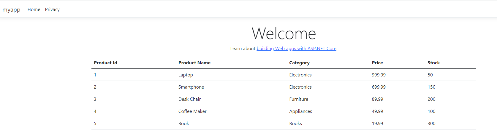

---
lab:
    title: 'Configure managed identity for Azure SQL Database'
    module: 'Explore Azure SQL Database safety practices for development'
---

# Configure managed identity for Azure SQL Database

In this exercise, you'll add a managed identity to the sample web app without storing credentials in the code.

Azure App Service offers a highly scalable and self-maintaining web hosting solution. One of its key features is the provision of a managed identity for your application, which simplifies securing access to Azure SQL Database and other Azure services. By using managed identities, you can enhance your app's security by removing the need to store sensitive information like credentials in connection strings. 

This exercise should take approximately **30** minutes to complete.

## Before you start

Before you can start this exercise, you need:

- An Azure subscription with appropriate permissions to create and manage resources.
- [**SQL Server Management Studio (SSMS)**](https://learn.microsoft.com/en-us/ssms/install/install) installed on your computer.
- [**Visual Studio Code**](https://code.visualstudio.com/download?azure-portal=true) installed on your computer with the following extension installed:
    - [Azure App Service](https://marketplace.visualstudio.com/items?itemName=ms-azuretools.vscode-azureappservice?azure-portal=true).

## Create a web application and an Azure SQL database

First, we'll create a web application and an Azure SQL database.

1. Sign in to the [Azure portal](https://portal.azure.com?azure-portal=true).
1. Search for **Subscriptions** and select it.
1. Navigate to **Resource providers** under **Settings**, search for the **Microsoft.Sql** provider, and select **Register**.
1. Back to the main page of Azure portal, select **Create a resource**.
1. Search for **Web App** and select it.
1. Select **Create** and fill in the required details:

    | Group | Setting | Value |
    | --- | --- | --- |
    | **Project Details** | **Subscription** | Select your Azure subscription. |
    | **Project Details** | **Resource group** | Select or create a new resource group |
    | **Instance Details** | **Name** | Enter a unique name for your web app |
    | **Instance Details** | **Runtime stack** | .NET 8 (LTS) |
    | **Instance Details** | **Region** | Select the region where you want to host your web app |
    | **Pricing plans** | **Pricing plan** | Basic |
    | **Database** | **Engine** | SQLAzure |
    | **Database** | **Server name** | Enter a unique name for your SQL server |
    | **Database** | **Database name** | Enter a unique name for your database |
    

    > **Note:** For production workloads, select **Standard - General purpose production apps**. Username and password of the new database are generated automatically. To retrieve these values after the deployment, go to the **Connection strings** located on **Environment variables** page of your app. 

1. Select **Review + create** and then **Create**. It might take a few minutes to the deployment to complete.
1. Connect to your database in SSMS and run the following code:

    >**Tip**: You can get the user ID and password assigned to your server by checking the connection string in the Service Connector page of your web app resource
 
    ```sql
    CREATE TABLE Products (
        ProductID INT PRIMARY KEY,
        ProductName NVARCHAR(100),
        Category NVARCHAR(50),
        Price DECIMAL(10, 2),
        Stock INT
    );
    
    INSERT INTO Products (ProductID, ProductName, Category, Price, Stock) VALUES
    (1, 'Laptop', 'Electronics', 999.99, 50),
    (2, 'Smartphone', 'Electronics', 699.99, 150),
    (3, 'Desk Chair', 'Furniture', 89.99, 200),
    (4, 'Coffee Maker', 'Appliances', 49.99, 100),
    (5, 'Book', 'Books', 19.99, 300);
    ```

## Add account as a SQL admin

Next, you'll add your account access to the database. This is needed because only accounts authenticated through Microsoft Entra can create other Microsoft Entra ID users which are a prerequisite for the subsequent steps in this exercise.

1. Navigate to the Azure SQL server you created earlier.
1. On the **Settings** left-hand menu, select **Microsoft Entra ID**.
1. Select **Set admin**.
1. Search for your account, then select it.
1. Select **Save**.

## Enable managed identity

Next, you'll enable system-assigned managed identity for your Azure Web App, which is a security best practice that allows for automated credential management.

1. Navigate to your Web App in the Azure portal.
1. In the **Settings** on left-hand menu, select **Identity**.
1. Under the **System assigned** tab, switch the **Status** to **On** and select **Save**. In case you receive a message asking if you want to enable system assigned managed identity for your Web App, select **Yes**.

## Grant access to Azure SQL database

1. Connect to the Azure SQL database again using SSMS. Select **Microsoft Entra MFA** and provide your user name.
1. Select your database, and then open a new query editor.
1. Execute the following SQL commands to create a user for the managed identity and assign the necessary permissions. Edit the script by providing your Web App name.

    ```sql
    CREATE USER [your-web-app-name] FROM EXTERNAL PROVIDER;
    ALTER ROLE db_datareader ADD MEMBER [your-web-app-name];
    ALTER ROLE db_datawriter ADD MEMBER [your-web-app-name];
    ```

## Create a web application

Next, you'll create a ASP.NET application that uses Entity Framework Core with Azure SQL Database to display a list of products from the product table.

### Create your project

1. On VS Code, create a new folder. Name the folder your project.
1. Open the terminal and run the following command to create your new MVC project.
    
    ```dos
   dotnet new mvc
    ```
    This will create a new ASP.NET MVC project in the folder you chose and load it in Visual Studio Code.

1. Run the following command to execute your application. 

    ```dos
   dotnet run
    ```
1. The terminal outputs *Now listening on: http://localhost:<port>*. Navigate to the URL in your web browser to access the application. 

1. Close the web browser and stop the application. Alternatively, you can stop the application by pressing `Ctrl+C` in the VS Code terminal.

### Update your project to connect to Azure SQL Database

Next, you'll update some configurations that will allow you to successfully connect to Azure SQL database using managed identity.

1. In your project, add the necessary NuGet packages for SQL Server.
    ```dos
    dotnet add package Microsoft.EntityFrameworkCore.SqlServer
    ```
1. In the root folder of your project, open the **appsettings.json** file and insert the `ConnectionStrings` section. Here, you'll replace `<server-name>` and `<db-name>` with the actual names of your server and database. This connection string is used by the default constructor in the `Models/MyDbContext.cs` file to establish a connection to your database.

    ```json
    {
      "Logging": {
        "LogLevel": {
          "Default": "Information",
          "Microsoft.AspNetCore": "Warning"
        }
      },
      "AllowedHosts": "*",
      "ConnectionStrings": {
        "DefaultConnection": "Server=<server-name>.database.windows.net,1433;Initial Catalog=<db-name>;Authentication=Active Directory Default;"
      }
    }
    ```
1. Save and close the file.

### Add your code

1. On the **Models** folder of your project, create a **Product.cs** file for your product entity with the following code. Replace `<app name>` with the actual name of your application.

    ```csharp
    namespace <app name>.Models;
    
    public class Product
    {
        public int ProductId { get; set; }
        public string ProductName { get; set; }
        public string Category { get; set; }
        public decimal Price { get; set; }
        public int Stock { get; set; }
    }
    ```
1. Create the folder **Database** on the root folder of your project.
1. On the **Database** folder of your project, create a **MyDbContext.cs** file for your product entity with the following code. Replace `<app name>` with the actual name of your application.

    ```csharp
    using <app name>.Models;
    
    namespace <app name>.Database;
    
    using Microsoft.EntityFrameworkCore;
    
    public class MyDbContext : DbContext
    {
        public MyDbContext(DbContextOptions<MyDbContext> options) : base(options)
        {
        }
    
        public DbSet<Product> Products { get; set; }
    }    
    ```
1. On the **Controllers** folder of your project, edit the classes `HomeController` and `IActionResult` for the **HomeController.cs** file, and add the `_context` variable with the following code.

    ```csharp
    private MyDbContext _context;

    public HomeController(ILogger<HomeController> logger, MyDbContext context)
    {
        _logger = logger;
        _context = context;
    }

    public IActionResult Index()
    {
        var data = _context.Products.ToList();
        return View(data);
    }
    ```

1. Also add `using.<app name>.Database` to the top of the file.
1. On the **Views -> Home** folder of your project, update the **Index.cshtml** file, and add the following code.

    ```html
    <table class="table">
        <thead>
            <tr>
                <th>Product Id</th>
                <th>Product Name</th>
                <th>Category</th>
                <th>Price</th>
                <th>Stock</th>
            </tr>
        </thead>
        <tbody>
            @foreach(var item in Model)
            {
                <tr>
                    <td>@item.ProductId</td>
                    <td>@item.ProductName</td>
                    <td>@item.Category</td>
                    <td>@item.Price</td>
                    <td>@item.Stock</td>
                </tr>
            }
        </tbody>
    </table>
    ```

1. Edit the **Program.cs** file and insert the provided code snippet just above the `var app = builder.Build();` line. This change ensures the code executes during the application’s startup sequence. Replace `<app name>` with the actual name of your application.

    ```csharp
    using Microsoft.EntityFrameworkCore;
    using <app name>.Database;

    var builder = WebApplication.CreateBuilder(args);

    // Add services to the container.
    builder.Services.AddControllersWithViews();
    builder.Services.AddDbContext<MyDbContext>(options =>
        options.UseSqlServer(builder.Configuration.GetConnectionString("DefaultConnection")));
    ```

    > **Note:** If you want to run your application before deployment, update the connection string with SQL user credentials. Username and password of the new database were generated automatically. To retrieve these values after the deployment, go to the **Connection strings** located on **Environment variables** page of your app. Once you’ve confirmed the application is running as expected, switch back to using the managed identity for a secure deployment process.

### Deploy your code

1. Open the **Command Palette** by pressing `Ctrl+Shift+P`.
1. Type **Azure App Service: Deploy to Web App...** and select it.
1. Select the folder containing your web application code.
1. Choose the web app you created in the previous step.
    > Note: You may receive a message: "Required configuration to deploy is missing from "your app". Select **Add Config**. Then follow the instructions and select your subscription, and app service resource.
1. Confirm the deployment when prompted.

## Test your application

Run your web application and verify that it can connect to the Azure SQL Database without any stored credentials.

1. Open a browser and navigate to the URL of your Azure Web App (for example, https://your-web-app-name.azurewebsites.net).
1. Verify that your web application is running and accessible.
1. You should see a web page like below.

    

## Set up continuous deployment (Optional)

1. Open the **Command Palette** by pressing `Ctrl+Shift+P`.
1. Type **Azure App Service: Configure Continuous Delivery...** and select it.
1. Follow the prompts to set up continuous deployment from your GitHub repository or Azure DevOps.

Consider the scenarios where it would be beneficial to use **User-Assigned Managed Identity** instead of **System-Assigned Managed Identity**.

## Clean up

When you're working in your own subscription, it's a good idea at the end of a project to identify whether you still need the resources you created. 

Leaving resources running unnecessarily can result in extra costs. You can delete resources individually or delete the entire set of resources in the [Azure portal](https://portal.azure.com?azure-portal=true).

## More information

For more information about auto-failover groups for Azure SQL Database, see [Managed identities in Microsoft Entra for Azure SQL](https://learn.microsoft.com/azure/azure-sql/database/authentication-azure-ad-user-assigned-managed-identity?azure-portal=true).
